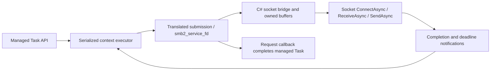

# Managed asynchronous socket transport

Status: **plan only**, requested 2026-09-22. No transport or compiler changes are
implemented by this document. Replace the product facade's poll/select pump with
completion-driven C# socket services. Kerberos and DFS remain on hold.

## Requirements and boundary

- Public managed operations support real async/await, including connection and
  disposal. No blocking `poll`, `select`, `Socket.Poll`, `Socket.Select`, periodic
  readiness scans, or `Task.Run` around synchronous network waits in this path.
- Require registration through `smb2_fd_event_callbacks` before connection starts.
  Keep translated request queues, credits, framing, signing, encryption, response
  parsing and protocol callbacks. C# supplies socket execution and scheduling.
- Add no C implementation, shim, helper header, source rewrite or generated-C#
  patch. Use `config/defines.json` / `-D` for names where sufficient and a
  translation override profile where required. Any missing compiler capability
  must be implemented generically in dotcc, not hidden in a source patch.
- Implement the host functions in authored C# included in the generated target
  project, following SQLite's `Sqlite.Bcl.cs`, `HostVfs` and
  [`Directory.Build.targets`](../../sqlite/Directory.Build.targets).
- Represent a libsmb2 socket with a distinct unmanaged C# struct containing one
  `nint` field. It must not be interchangeable with a shared Libc file descriptor.
  The pinned upstream spelling is **`t_socket`**, rather than `socket_t`.
- The struct is authored entirely in C#. No new C typedef or C struct is needed.
  Prefer suppressing upstream's guarded integer typedef with
  `T_SOCKET_DEFINED=1` and teaching the translation profile that the existing
  spelling `t_socket` denotes the authored managed type.
- Preserve the required solution, default translation entrypoint, final output
  path, named generated constants, raw/processed comparison and NativeAOT support.

The BCL can internally use OS readiness mechanisms to implement Socket async I/O.
The requirement concerns the managed wrapper/host: it awaits completions and does
not implement another readiness-polling loop or occupy a thread while waiting.

## Evidence and feasibility limits

These findings refer to pinned libsmb2
`99d5cffc85e4aa8d517649568ff8ec2008e35e90`:

| Existing code | Consequence for this design |
| --- | --- |
| `include/smb2/libsmb2.h`: `smb2_fd_event_callbacks`, `smb2_service_fd` | Register fd addition/removal and event-interest callbacks; service translated code on actual completions. No replacement SMB state machine is needed. |
| `lib/compat.h` and public header: guarded `typedef int t_socket` | The type is an integer alias today, and generated fields/callbacks use `int`. Merely renaming the typedef does not produce a strong C# struct. |
| `lib/socket.c`: `connect_async_ai(..., int *fd_out)`, `(int)fd`, local `int fd` in `smb2_connect_async_next_addr` | Even after a typedef mapping, integer round trips remain. Do not store a native pointer/Socket.Handle in those integers or reinterpret `int*` as a pointer to a pointer-sized struct. |
| `lib/socket.c`: `writev` uses a local iovec array and a pointer to stack-local `tmp_spl` | Pending BCL sends cannot retain the passed pointers after `writev` returns. |
| `lib/socket.c`: `smb2_change_events` suppresses unchanged masks using context-wide `smb2->events` | A second connecting fd may not receive a fresh event-mask callback. Addition and connect completion must carry enough state to avoid a missed wakeup. |
| `smb2_close_connecting_fd` closes without a matching `change_fd(DEL)` in that path | Host close must invalidate registrations itself; DEL is not the sole ownership signal. |
| `smb2_get_fds` documents Happy Eyeballs timeout and invalid-fd service | A real one-shot connection deadline is still required. Callbacks alone do not schedule the next address. |
| `getaddrinfo` inside `smb2_connect_async` | The C entrypoint is nominally async but DNS is synchronous. Prepare DNS asynchronously before entering it. |
| `lib/sync.c`, server code and several original C tests use poll/select | Their historical execution is not evidence of this new callback-driven product path. Keep compatibility profiles explicit. |

Dotcc's [current overrides](../../docs/macro-overrides.md) replace active macro
definitions and name anonymous field types. They do **not** introduce arbitrary
external managed types or rewrite function signatures. Overrides do not predefine
absent macros, survive `#undef` automatically, or change function-like arity.
Ordinary `-D` aliases rename tokens but leave bundled socket prototypes typed as
`int`. The fixed predefined-type list in `Compiler.Resources.cs` is not currently
a profile-driven custom-type mechanism.

Therefore, function-name redirection should use existing `-D` support where it
works, but the complete strong-handle requirement needs a compiler feasibility
milestone. Do not promise a defines-only solution with today's implementation.
Do not redefine `int`, enable Windows compatibility branches on Linux, inject C
declarations through macro bodies, or use regex output rewrites to simulate it.

## Translation configuration and strong handles

Inventory the **active preprocessed** client source, including declarations and
all call sites. Prefer aliases such as `socket=dotcc_smb_socket`,
`connect=dotcc_smb_connect`, `readv=dotcc_smb_readv`, and
`writev=dotcc_smb_writev` in `defines.json`. These are candidate aliases to prove,
not a ready-to-run profile. Use exact-body/signature overrides for actual active
compatibility macros that replace them; do not combine `-D` and a macro override
for the same name where dotcc rejects that overlap. Apply configuration to every
library object and record per-unit override reports before linking.

Plan a generic, explicit managed-host type/binding extension to the translation
profile if the feasibility check confirms the current gap. Final schema names
are to be designed in that compiler milestone; none are existing CLI options.
The contract must provide:

1. Recognition of `t_socket` as an externally supplied managed type, with
   `T_SOCKET_DEFINED=1` suppressing upstream's existing integer typedef in both
   guarded headers. The C# struct may itself be named `t_socket`, or the profile
   may bind that spelling to `Managed.Smb.SmbSocket`. Register its pointer-sized
   signed backing storage, unmanaged layout/alignment and consistent scalar
   operations/conversions. No C declaration or typedef is added. Dotcc must know
   the type during parsing/binding/layout; merely adding the C# file at build
   time is not enough with the current compiler.
2. Typed host-call binding for selected socket returns and descriptor parameters,
   including declarations from bundled headers. Renaming an `int` prototype alone
   cannot accomplish this. Exact signatures and ambiguous matches are checked.
3. Explicit compiler-generated bridges for the upstream integer scratch paths.
   Allocate positive registry tokens that fit `int`; store them in the struct's
   `nint` field. Checked conversion of those tokens preserves the pinned C casts
   without truncating a pointer. Never reuse a retired token while an old reference
   can survive; the initial implementation can use monotonic tokens and fail
   cleanly on exhaustion. Reserve `-1` for the upstream invalid handle, and never
   publish uninitialized/default handles. Do not provide a public implicit
   conversion from `SmbSocket` to a Libc descriptor.
4. Correct types for context fields, `connecting_fds`, pointers, `sizeof`,
   `memmove` lengths, function pointers, constants and generated public APIs.
   A C# alias alone is insufficient. Retain plain integers only at audited C
   compatibility boundaries and convert explicitly; do not change unrelated ints.
5. Identical type/binding metadata in every object, link-time mismatch rejection,
   cache invalidation and usable diagnostics. Both raw and postprocessed output
   must reference the authored type, without a duplicate generated declaration.

Proposed authored type shape is a sequential unmanaged `readonly struct
SmbSocket` with one internal readonly `nint Value`, equality/hash support and
controlled internal construction. The value is a host-registry token, not an OS
socket handle, pointer, fd or GCHandle. The registry owns the BCL Socket and I/O
state. Generated integer compatibility conversions stay implementation details.

Mapping the current four-byte `t_socket` to a pointer-sized struct changes private
layout on x64. Recompute all affected layouts in the compiler; do not retain
four-byte fields while allocating eight-byte arrays. This profile is not binary
ABI-compatible with the original native `smb2_context`. Compare SMB wire behavior
with native; separately verify the managed profile's size/alignment/offsets and
raw/processed identity. Unaffected wire structures retain their existing probes.

## C# host functions

Add `src/LibSmb2.Bcl.cs` as a partial `Managed.Smb.LibSmb2` bridge, plus authored
`src/SmbSocket.cs` and `src/HostSockets*.cs` as useful. Include them exactly once
in each product and raw generated project. They compile with generated nested
types and the embedded C runtime, avoiding a project-reference cycle.

The active Linux-shaped client uses vector I/O, so replacing only `recv`/`send`
would not replace its transport. Inventory and bind the following surface:

| Function group | Host behavior |
| --- | --- |
| `socket`, `connect` | Allocate a typed registry handle; start `Socket.ConnectAsync`; report pending through the original `EINPROGRESS` contract; latch completion and `SO_ERROR`. |
| `readv` / active receive calls | Copy from a bounded host receive buffer into the supplied vectors during the C call. Return a positive short count, would-block, EOF or the saved error with the original conventions. |
| `writev` / active send calls | Copy accepted bytes into an owned bounded send queue, return only that accepted count, and asynchronously drain it in order. Return would-block when no capacity is available. |
| `getsockopt`, `setsockopt` | Preserve the options actually used: connect errors, TCP_NODELAY, reuse/linger and required buffer settings. Translate values using named profile constants. Unsupported options are explicit errors. |
| `fcntl` or the active nonblocking helper | Maintain the supported logical flag state without turning a call into a blocking network operation. |
| `close`, `shutdown` where reachable | Invalidate the handle/registration, stop new I/O and initiate cancellation/close. The managed owner awaits drain before releasing host resources. Preserve required close/linger semantics. |
| `getaddrinfo`, `freeaddrinfo` | Materialize/free a C-compatible address chain from an asynchronously prepared resolution result; retain allocator ownership. |

`close`, `read`, `write` and `fcntl` are also file operations. Do not globally route
an unrelated file fd into the socket registry. Use typed bindings or explicitly
separate integer file adapters where the source closure requires both. Keep
upstream test stdin/stdout/local-file I/O in its original Libc domain. The current
entropy configuration excludes the `/dev/urandom` fallback, but that is not a
permanent justification for unchecked global remapping. Detect profile changes
that introduce an unclassified descriptor use.

C-facing host methods remain synchronous and nonblocking. They cannot return
Task in place of a C `ssize_t`. Async socket operations run over buffers owned by
the host, while translated calls only transfer bytes to/from those buffers.
The bounded send queue acts as a userspace socket send buffer: acceptance does
not mean server receipt or SMB request success. Preserve partial send counts,
ordering and deferred transport errors; never replay accepted bytes on retry.
Keep it draining even if upstream removes write interest after accepting a PDU.

Use one outstanding receive and one send per socket initially. Do not use
zero-byte readiness probes. Stop scheduling receives at the buffer cap and resume
when reads release capacity. Retain bytes completed while read interest changes;
deliver buffered bytes before a following EOF/error. Return read zero only for
EOF or a zero-length request, never as a substitute for would-block. Do not retain
borrowed iovecs, stack prefixes or translated pointers across an await.

On async failure, store the error in host state. Set translated thread-local errno
only in the synchronous host call consuming that state, on the same execution
turn as the translated caller. Background continuations must not set errno on
another worker and assume the servicing thread will see it. Exceptions must not
escape static C-style callback entrypoints.

## Awaitable event servicing

Register static change-fd and change-events callbacks before submitting connect.
Use the context's opaque state or a rooted context registry to locate the executor.
Each connection has a serialized async work queue; there is no dedicated waiting
thread. All translated context mutation/submission/service/destruction runs there.
Keep the separate protection for upstream's global context list.

Callback rules:

- ADD associates the typed socket with the context and checks already-latched
  connection/I/O completion. Bootstrap connecting sockets even if the context-wide
  event mask suppresses their individual change-events callback.
- A mask change records desired read/write interest. Completion, buffer-capacity
  transitions and new interest determine when servicing is useful. Event masks
  (`POLLIN`, `POLLOUT`, etc.) remain upstream protocol-integration vocabulary;
  their use does not imply calling poll.
- Completion enqueues a notification; it never reenters translated code inline.
  This includes synchronously completed BCL operations during C submission,
  before upstream finishes publishing callbacks and connection state.
- The executor validates context/socket lifetime, derives useful event bits and
  calls `smb2_service_fd`. Coalesce notifications, recheck latched state after
  interest changes and yield fairly when consuming buffered data. A permanently
  writable socket must not cause an unbounded notification/service loop.
- DEL detaches interest. Host close also invalidates it. Late completions can
  release their own buffers but cannot call through freed context pointers or
  operate on a newly registered socket with an old token.

Export required `POLL*`, socket-option and errno macros through `--emit-define`
where they are not already available. Use generated named constants in host and
facade code; do not repeat the earlier numeric-literal workaround.

Use one-shot timers for actual deadlines, not recurring readiness polling. Query
the next Happy Eyeballs delay through `smb2_get_fds` only at connection state
transitions, and schedule the documented invalid-fd `smb2_service_fd(..., -1, 0)`
at that deadline. Reevaluate after service; cancel when a connection wins or the
address list is exhausted. Multiple connecting sockets must remain supported.

For initial operation deadlines keep the existing explicit policy of disabled
upstream PDU timers and a managed deadline, with documented terminal-context
cleanup. If upstream timers are enabled later, their documented service timing
needs a separate deadline integration; do not silently add a once-per-second
polling loop. Preserve the recorded compound-metadata cleanup limitation until
separately resolved under the existing scope rules.

Resolve DNS with `Dns.GetHostAddressesAsync` before translated connect. Preserve
the original server name for SMB identity and future authentication; do not pass
only a chosen IP and accidentally alter it. A request-scoped prepared result
supplies the synchronous C resolver with all selected IPv4/IPv6 addresses, leaving
upstream interleaving/connection attempts intact. Bind that result to the short
executor call explicitly, not process-wide mutable state shared by connections.
An unprepared resolver call fails clearly rather than blocking. Copy sockaddr
arguments before initiating ConnectAsync because they can be stack-backed too.

## Managed request lifetime and compatibility

Replace stack `CallbackState`, lexical `fixed` scopes and the blocking Wait method
with owned operation state. Task completion is driven by the actual upstream
callback using asynchronously dispatched continuations. Hold paths, callback
tokens and pinned/copied application buffers until the request has completed or
its context has been destroyed and host I/O has drained. The callback may happen
synchronously during submission; establish ownership first. Keep unsafe pointer
work in synchronous helpers so await does not cross an unsafe/ref-struct scope.

Initially preserve one submitted operation per connection; awaiting a per-context
queue is sufficient and avoids bundling a multiple-in-flight API redesign into
this change. Independent connections remain concurrent. Cancellation before
submission prevents it; active cancellation initially retains the documented
drain-before-return behavior. Prompt per-request protocol cancellation is not
implied by using await. A write is never promised to roll back.

DisposeAsync stops admission, drains/settles requests, performs asynchronous
file-close/disconnect where possible, destroys the context on its executor, and
awaits outstanding host operations before releasing buffers and callback roots.
Finalization is local cleanup, never a graceful blocking network exchange.
Synchronous managed convenience methods may block on this async core only outside
the executor/callback path; document/reject reentrant synchronous use. No second
poll-based implementation is introduced for these methods.

Original low-level C synchronous functions and server loops still contain
poll/select. The callback-only product profile must explicitly reject entry into
those unsupported wait paths, without sending a typed socket to Libc's fd table.
Resolve retained declarations/bodies through scoped host bindings so the full
generated assembly still builds and roots under NativeAOT. Do not delete protocol
sources or claim server-hosting compatibility. Preserve the old Libc transport
only in an explicitly isolated regression profile when needed by unchanged
upstream C tests; it must not be a hidden product fallback. Explain this change
to the earlier low-level synchronous-API target in the public API documentation.

## Generation and deliverables

Proposed authored files and responsibilities:

| File | Responsibility |
| --- | --- |
| `config/defines.json` | Proven translation aliases and selected feature defines. |
| `config/dotcc-overrides.json` | Required macro and future typed host bindings, with exact matches/provenance. |
| `src/LibSmb2.Bcl.cs` | Partial-class C-facing entrypoints using generated types/constants. |
| `src/SmbSocket.cs`, `src/HostSockets*.cs` | Strong handle, registry, bounded buffers and BCL async operations. |
| `src/Managed/SmbConnection.cs` and executor helpers | Awaitable requests, callbacks, deadlines and owning API. |
| `Directory.Build.targets` or emitted explicit Compile items | Include authored host files in raw, final and staged generated projects exactly once. |
| `scripts/translate.py`, build/test tooling | Full regeneration, configuration/host-source hashes and explicit profile selection. |

The production default remains `scripts/translate.sh`, with final output at
`generated/TranslatedLibsmb2/` and sample at `ManagedConsumer.slnx`. Project
integration must work before the first raw build, in staging, and after promotion
from any working directory. Include files as authored Compile inputs as SQLite
does; do not splice method bodies into generated output. Check the postprocessor
does not rewrite linked authored files or lose their references.

Shared Libc networking remains available to other translated programs. The new
product's call graph must resolve socket operations to the C# host instead. Check
binding and handle-domain separation, not merely absence of embedded unused Libc
source. Include host source/profile hashes in receipts and stale-output checks.

## Milestones and acceptance

Implementation is not started by this planning request. Once authorized, commit
each significant tested milestone locally, retaining Kerberos/DFS hold and the
upstream-only fault-injection rule.

### A0 — Prove source and compiler bindings

- [ ] Inventory active socket/file descriptors, declaration order, macro aliases,
      integer scratch paths and retained sync/server call sites.
- [ ] Prove which names work with existing defines; document minimal generic
      compiler additions for strong types and typed host signatures.
- [ ] Implement those compiler additions if necessary, with managed-only tests
      using source strings and the real pinned inputs; add no C shim/header/file.
- [ ] Verify size/alignment/arrays/function pointers, checked token round trips,
      raw/processed/object linking and rejection of accidental Libc descriptor use.

Gate: translated context fields and fd callbacks use the actual nint-backed
struct, and the complete library binds to authored C# without source edits or
native application networking imports. No flags-only success claim if a compiler
extension was required.

### A1 — Implement the asynchronous socket host

- [ ] Add the C# project inputs and typed registry; implement connect, bounded
      send/receive, options, errno/error storage and close/drain ownership.
- [ ] Exercise ordinary loopback data transfers with partial counts, EOF,
      backpressure, concurrent directions and independent sockets on Linux and
      Windows when runners exist. Use C# tests; do not add C harness code.
- [ ] Demonstrate that socket and Libc file-handle ownership cannot be mixed.

### A2 — Replace the facade pump

- [ ] Register fd-event callbacks, implement the serialized completion executor,
      prepared async DNS, Happy Eyeballs and one-shot operation deadlines.
- [ ] Replace Task.Run/Wait/stack callback state with owned awaitable operations;
      move DisposeAsync and optional synchronous facade methods onto the same core.
- [ ] Verify normal connect/read/write/metadata/disconnect, simultaneous contexts,
      queued operations/disposal and ordinary GC/lifetime behavior. Test event
      registration ordering and synchronous completions as scheduler correctness,
      not custom network fault injection.

### A3 — Qualify and promote the product profile

- [ ] Run the existing real Samba sample/API scenarios for raw/processed JIT and
      NativeAOT, preserving dialect/signing/encryption coverage and native controls.
- [ ] Audit and instrument the product path: no host/wrapper readiness polling,
      no blocked worker per idle connection, no idle recurring wakeup without an
      actual deadline, no unbounded buffered bytes or duplicate service storms.
- [ ] Record ordinary load evidence: transfer throughput, allocations, buffered
      bytes, thread behavior with idle connections, fairness and disposal drain.
- [ ] Run unchanged upstream tests under the declared compatible profile and
      report which cases exercise the new host versus only the legacy baseline.
      Their source-driven manual polling must not silently define product behavior.
- [ ] Re-run affected compiler/runtime/postprocessor checks, whole-assembly-rooted
      NativeAOT, clean regeneration and outside-directory invocation. Record
      Windows/Linux evidence separately; unavailable Windows execution is unverified.
- [ ] Update host/API/usage/validation docs with the new ABI, compatibility profile,
      cancellation policy, remaining gaps and exact receipts.

Do not introduce custom transport resets, packet corruption or invented allocation
failures. Any injected failure still needs the exact pinned upstream counterpart
from [test-scope.md](test-scope.md). Existing functional and scheduler checks remain
allowed, and already recorded native baseline failures must not become passes.

## BCL references

The intended implementation uses the .NET 10
[Socket.ConnectAsync](https://learn.microsoft.com/en-us/dotnet/api/system.net.sockets.socket.connectasync?view=net-10.0),
[Socket.ReceiveAsync](https://learn.microsoft.com/en-us/dotnet/api/system.net.sockets.socket.receiveasync?view=net-10.0),
[Socket.SendAsync](https://learn.microsoft.com/en-us/dotnet/api/system.net.sockets.socket.sendasync?view=net-10.0)
and [Dns.GetHostAddressesAsync](https://learn.microsoft.com/en-us/dotnet/api/system.net.dns.gethostaddressesasync?view=net-10.0)
contracts. Actual send counts and receive EOF must remain visible through the
bridge; documentation availability is not cross-platform execution evidence.
