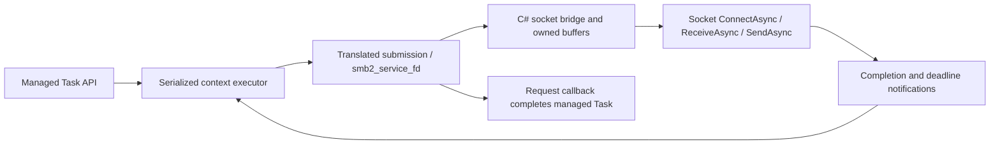

# Managed asynchronous socket transport

Status: **implementation authorized and in progress**, 2026-09-23. Compiler
prerequisites shipped in `10c2c60`; this revision restores the lost plan updates
for function overrides and external type registration. Replace the product
facade's poll/select pump with completion-driven C# socket services. Kerberos
and DFS remain on hold. Commit each significant tested milestone.

## Requirements and boundary

- Public managed operations support real async/await, including connection and
  disposal. No blocking `poll`, `select`, `Socket.Poll`, `Socket.Select`, periodic
  readiness scans, or `Task.Run` around synchronous network waits in this path.
- Require registration through `smb2_fd_event_callbacks` before connection starts.
  Keep translated request queues, credits, framing, signing, encryption, response
  parsing and protocol callbacks. C# supplies socket execution and scheduling.
- Add no C function implementation, source rewrite or generated-C# patch. Prefer
  `config/defines.json` / `-D` and translation overrides. The user permits a
  fallback typedef plus struct declaration in `libsmb2/build/managed/config.h`
  if necessary to describe the handle layout. All socket behavior stays in C#.
  Any remaining compiler capability must be implemented generically in dotcc.
- Implement the host functions in authored C# included in the generated target
  project, following SQLite's `Sqlite.Bcl.cs`, `HostVfs` and
  [`Directory.Build.targets`](../../sqlite/Directory.Build.targets).
- Represent a libsmb2 socket with a distinct unmanaged C# struct containing one
  `int` field, preserving upstream's four-byte descriptor storage. Conversion to
  `int` is explicit; conversion from `int` is implicit. The value identifies an
  entry in a separate socket registry, not a shared Libc file descriptor.
  The pinned upstream spelling is **`t_socket`**, rather than `socket_t`.
- Prefer authoring the struct entirely in C#, suppressing upstream's integer typedef with
  `T_SOCKET_DEFINED=1` and teaching the translation profile that the existing
  spelling `t_socket` denotes the authored managed type. If the declaration-only
  config.h fallback is used, emit the storage type once and supply its operators
  and behavior in an authored C# partial declaration instead.
- Preserve the required solution, default translation entrypoint, final output
  path, named generated constants, raw/processed comparison and NativeAOT support.

The BCL can internally use OS readiness mechanisms to implement Socket async I/O.
The requirement concerns the managed wrapper/host: it awaits completions and does
not implement another readiness-polling loop or occupy a thread while waiting.

## Evidence and feasibility limits

These findings refer to pinned libsmb2
`99d5cffc85e4aa8d517649568ff8ec2008e35e90`:

| Existing code | Consequence for this design |
| --- | --- |
| `include/smb2/libsmb2.h`: `smb2_fd_event_callbacks`, `smb2_service_fd` | Register fd addition/removal and event-interest callbacks; service translated code on actual completions. No replacement SMB state machine is needed. |
| `lib/compat.h` and public header: guarded `typedef int t_socket` | The type is an integer alias today, and generated fields/callbacks use `int`. Merely renaming the typedef does not produce a strong C# struct. |
| `lib/socket.c`: `connect_async_ai(..., int *fd_out)`, `(int)fd`, local `int fd` in `smb2_connect_async_next_addr` | Explicit conversion to int preserves the helper's cast; implicit conversion from int restores the handle on assignment/callback invocation. Keep `int*` storage as int; no pointer reinterpretation is needed. |
| `lib/socket.c`: `writev` uses a local iovec array and a pointer to stack-local `tmp_spl` | Pending BCL sends cannot retain the passed pointers after `writev` returns. |
| `lib/socket.c`: `smb2_change_events` suppresses unchanged masks using context-wide `smb2->events` | A second connecting fd may not receive a fresh event-mask callback. Addition and connect completion must carry enough state to avoid a missed wakeup. |
| `smb2_close_connecting_fd` closes without a matching `change_fd(DEL)` in that path | Host close must invalidate registrations itself; DEL is not the sole ownership signal. |
| `smb2_get_fds` documents Happy Eyeballs timeout and invalid-fd service | A real one-shot connection deadline is still required. Callbacks alone do not schedule the next address. |
| `getaddrinfo` inside `smb2_connect_async` | The C entrypoint is nominally async but DNS is synchronous. Prepare DNS asynchronously before entering it. |
| `lib/sync.c`, server code and several original C tests use poll/select | Their historical execution is not evidence of this new callback-driven product path. Keep compatibility profiles explicit. |

Dotcc now supports [semantic function overrides](../../docs/function-overrides.md)
and [external type registration](../../docs/external-types.md), alongside
[macro overrides](../../docs/macro-overrides.md) and anonymous field naming.
`functionOverrides` binds an existing C declaration/signature to an intrinsic or
authored static C# method while preserving an addressable wrapper. Prototype-only
declarations can receive managed implementations without native imports.
`externalTypes` registers authored unmanaged types and optional size/alignment;
repeatable `--type-name` provides name-only registration.

Neither function overrides nor ordinary `-D` aliases change declared C function
signatures. An int-based socket prototype therefore still needs an audited
managed bridge at that boundary. Prove the complete strong-handle path in A0,
using existing features before adding generic compiler support. Macro overrides
do not predefine absent macros, survive `#undef` automatically, or change arity.
Do not redefine `int`, enable Windows compatibility branches on Linux, inject C
declarations through macro bodies, or use regex output rewrites to simulate it.

## Translation configuration and strong handles

Inventory the **active preprocessed** client source, including declarations and
all call sites. Prefer aliases such as `socket=dotcc_smb_socket`,
`connect=dotcc_smb_connect`, `readv=dotcc_smb_readv`, and
`writev=dotcc_smb_writev` in `defines.json`. These are candidate aliases to prove,
not a ready-to-run profile. Use exact-body/signature overrides for actual active
compatibility macros that replace them; do not combine `-D` and a macro override
for the same name where dotcc rejects that overlap. Apply configuration to every
library object and record per-unit override reports before linking.

Use implemented `externalTypes` registration for `t_socket` and semantic
`functionOverrides` for selected host calls with their actual canonical C
signatures. Keep any required int/handle adaptation in authored methods and
operators. The contract must provide:

1. Recognition of `t_socket` as an externally supplied managed type, with
   `T_SOCKET_DEFINED=1` suppressing upstream's existing integer typedef in both
   guarded headers. Prefer naming the C# struct `t_socket` too. Register its
   four-byte signed backing storage, unmanaged layout/alignment and consistent scalar
   operations/conversions. The preferred path adds no C declaration or typedef;
   the permitted config.h fallback can supply the layout instead. Dotcc must know
   the type during parsing/binding/layout via `externalTypes`; adding only the
   C# file does not register it with the C frontend.
2. Typed host-call binding for selected socket returns and descriptor parameters,
   including declarations from bundled headers. Renaming an `int` prototype alone
   cannot accomplish this. Semantic overrides check exact signatures and ambiguous
   matches, but preserve the C signature. Prove managed int/handle bridges suffice.
3. Preserve upstream casts and assignments so the authored C# conversion
   operators handle integer round trips: explicit `t_socket` to `int`, implicit
   `int` to `t_socket`. No pointer-width narrowing or special per-helper bridge is
   needed. Allocate positive int registry tokens. Never reuse a retired token
   while an old reference can survive; the initial implementation can use
   monotonic tokens and fail cleanly on exhaustion. Reserve `-1` for the upstream
   invalid handle, and never publish uninitialized/default handles. There must
   be no implicit conversion from the handle to a Libc descriptor.
4. Correct types for context fields, `connecting_fds`, pointers, `sizeof`,
   `memmove` lengths, function pointers, constants and generated public APIs.
   A C# alias alone is insufficient. Retain plain integers only at audited C
   compatibility boundaries and convert explicitly; do not change unrelated ints.
5. Identical type/binding metadata in every object, link-time mismatch rejection,
   cache invalidation and usable diagnostics. Both raw and postprocessed output
   must reference one type identity. Use either the authored external type or
   the generated storage type with an authored partial extension, never both
   complete storage definitions.

### Implemented external types and function overrides

The version-1 profile already accepts optional layout:

```json
{
  "version": 1,
  "externalTypes": [
    { "name": "t_socket", "layout": { "size": 4, "alignment": 4 } }
  ]
}
```

Name-only registration is also available as repeatable `--type-name NAME`.
CLI and profile names merge; repeating a name preserves its explicit layout.
Built-in/reserved names and conflicting layouts are rejected. Names alone permit
pointer and pass-through signatures. Supply layout for sizeof, alignment and
aggregate offsets; absent metadata must not become a guessed zero size. Layout
requires positive size, power-of-two alignment no greater than 128, and size
divisible by alignment. Registration supplies no fields or conversion operators,
and emits no duplicate C# struct. It does not accept C source text or full member
layouts; use the declaration-only fallback if C members are needed.

The same profile's `functionOverrides` entries select an exact name, canonical C
return/parameter signature, and target such as
`{"kind":"managedMethod","method":"global::Managed.Smb.HostSockets.Connect"}`.
Use physical translation-unit/declaration-file selectors where needed and
`requireMatch` appropriate to each source invocation. Targets are synchronous
C-facing methods; the host schedules async operations over owned state. This
does not turn a C return type into a Task or rewrite the original signature.
The generated wrapper preserves direct calls and function-pointer identity.

Apply both registrations while translating every relevant C input. Options,
reports and object contracts retain their identities; links reject incompatible
replacements/layouts. Object-only linking cannot apply new rules to emitted C#.
Ordinary C# builds validate authored method/type availability. Compiler tests
already cover authored four-byte structs, conversion operators, signature and
layout checks, source/object output and managed-method wrappers. A0 still must
prove the pinned libsmb2 call graph, raw/processed products and descriptor-domain
separation; compiler tests alone do not establish transport correctness.

### Permitted declaration-only fallback

If full C members are needed beyond implemented opaque type registration, generate
`build/managed/config.h` with a C struct containing one int field and its
`t_socket` typedef. Define `T_SOCKET_DEFINED` so both upstream headers skip their
integer alias. Verify this declaration is seen before every use in every relevant
translation unit; changing the include directory alone is not proof of ordering.
Keep the declaration/template in tracked configuration and make `translate.sh`
recreate the build header from it, with hashes and include precedence recorded.
No manual file under ignored `build/` may become an unreproducible prerequisite.

This gives dotcc the field layout through its existing C aggregate support. Let
it emit the partial C# storage struct, and add explicit-to-int / implicit-from-int
operators in an authored C# partial declaration of that exact generated type,
including the namespace/nesting chosen by the library output. Do not redeclare
the backing field in C#. The generated type's modifiers determine which partial
modifiers are valid; the readonly sketch below describes the preferred authored
type, not a requirement to rewrite generated storage.

A C struct is not an integer scalar: existing C casts, assignments and comparisons
may still need generic host-type binding/lowering support before the C# operators
can be used. Prove those expressions as part of A0 rather than assuming that
adding the declaration alone solves them. This fallback relaxes only the ban on
C type declarations; it does not authorize C socket implementations or upstream
source edits.

The authored type is a sequential unmanaged readonly struct. Its essential
conversion shape is below (design sketch only; equality/comparison members omitted):

```csharp
[StructLayout(LayoutKind.Sequential)]
public readonly struct t_socket
{
    internal readonly int Value;
    private t_socket(int value) => Value = value;

    public static explicit operator int(t_socket value) => value.Value;
    public static implicit operator t_socket(int value) => new(value);
}
```

Add equality/hash support and the comparisons required by the active source,
including `SMB2_VALID_SOCKET(sock)` and the invalid sentinel. The value is a
host-registry token, not an OS socket handle, pointer, fd or GCHandle. The registry
owns the BCL Socket and async state; conversion alone does not allocate or validate
a socket. Validate registry membership/ownership at host entrypoints. The implicit
conversion from int cannot establish provenance by itself, so descriptor-domain
separation also depends on correct call bindings and the active-use audit.

Verify `sizeof(t_socket) == sizeof(int) == 4`, matching alignment, context offsets,
array stride and callback signatures against the selected native ABI and across
raw/processed output. The wrapper should preserve existing descriptor layouts;
it does not require the earlier proposed pointer-width layout change. Matching
storage layout does not make the managed registry tokens usable as native fds.

## C# host functions

Add `src/LibSmb2.Bcl.cs` as a partial `Managed.Smb.LibSmb2` bridge, plus authored
`src/HostSockets.Types.cs` and other `src/HostSockets*.cs` as useful. Include them exactly once
in each product and raw generated project. They compile with generated nested
types and the embedded C runtime, avoiding a project-reference cycle.

The active Linux-shaped client uses vector I/O, so replacing only `recv`/`send`
would not replace its transport. Inventory and bind the following surface:

| Function group | Host behavior |
| --- | --- |
| `socket`, `connect` | Allocate a typed registry handle; start `Socket.ConnectAsync`; report pending through the original `EINPROGRESS` contract; latch completion and `SO_ERROR`. |
| `readv` / active receive calls | Copy from a bounded host receive buffer into the supplied vectors during the C call. Return a positive short count, would-block, EOF or the saved error with the original conventions. |
| `writev` / active send calls | Copy accepted bytes into an owned bounded send queue, return only that accepted count, and asynchronously drain it in order. Return would-block when no capacity is available. |
| `getsockopt`, `setsockopt` | Preserve the options actually used: connect errors, TCP_NODELAY, reuse/linger and required buffer settings. Translate values using named profile constants. Unsupported options are explicit errors. |
| `fcntl` or the active nonblocking helper | Maintain the supported logical flag state without turning a call into a blocking network operation. |
| `close`, `shutdown` where reachable | Invalidate the handle/registration, stop new I/O and initiate cancellation/close. The managed owner awaits drain before releasing host resources. Preserve required close/linger semantics. |
| `getaddrinfo`, `freeaddrinfo` | Materialize/free a C-compatible address chain from an asynchronously prepared resolution result; retain allocator ownership. |

`close`, `read`, `write` and `fcntl` are also file operations. Do not globally route
an unrelated file fd into the socket registry. Use typed bindings or explicitly
separate integer file adapters where the source closure requires both. Keep
upstream test stdin/stdout/local-file I/O in its original Libc domain. The current
entropy configuration excludes the `/dev/urandom` fallback, but that is not a
permanent justification for unchecked global remapping. Detect profile changes
that introduce an unclassified descriptor use.

C-facing host methods remain synchronous and nonblocking. They cannot return
Task in place of a C `ssize_t`. Async socket operations run over buffers owned by
the host, while translated calls only transfer bytes to/from those buffers.
The bounded send queue acts as a userspace socket send buffer: acceptance does
not mean server receipt or SMB request success. Preserve partial send counts,
ordering and deferred transport errors; never replay accepted bytes on retry.
Keep it draining even if upstream removes write interest after accepting a PDU.

Use one outstanding receive and one send per socket initially. Do not use
zero-byte readiness probes. Stop scheduling receives at the buffer cap and resume
when reads release capacity. Retain bytes completed while read interest changes;
deliver buffered bytes before a following EOF/error. Return read zero only for
EOF or a zero-length request, never as a substitute for would-block. Do not retain
borrowed iovecs, stack prefixes or translated pointers across an await.

On async failure, store the error in host state. Set translated thread-local errno
only in the synchronous host call consuming that state, on the same execution
turn as the translated caller. Background continuations must not set errno on
another worker and assume the servicing thread will see it. Exceptions must not
escape static C-style callback entrypoints.

## Awaitable event servicing



Register static change-fd and change-events callbacks before submitting connect.
Use the context's opaque state or a rooted context registry to locate the executor.
Each connection has a serialized async work queue; there is no dedicated waiting
thread. All translated context mutation/submission/service/destruction runs there.
Keep the separate protection for upstream's global context list.

Callback rules:

- ADD associates the typed socket with the context and checks already-latched
  connection/I/O completion. Bootstrap connecting sockets even if the context-wide
  event mask suppresses their individual change-events callback.
- A mask change records desired read/write interest. Completion, buffer-capacity
  transitions and new interest determine when servicing is useful. Event masks
  (`POLLIN`, `POLLOUT`, etc.) remain upstream protocol-integration vocabulary;
  their use does not imply calling poll.
- Completion enqueues a notification; it never reenters translated code inline.
  This includes synchronously completed BCL operations during C submission,
  before upstream finishes publishing callbacks and connection state.
- The executor validates context/socket lifetime, derives useful event bits and
  calls `smb2_service_fd`. Coalesce notifications, recheck latched state after
  interest changes and yield fairly when consuming buffered data. A permanently
  writable socket must not cause an unbounded notification/service loop.
- DEL detaches interest. Host close also invalidates it. Late completions can
  release their own buffers but cannot call through freed context pointers or
  operate on a newly registered socket with an old token.

Export required `POLL*`, socket-option and errno macros through `--emit-define`
where they are not already available. Use generated named constants in host and
facade code; do not repeat the earlier numeric-literal workaround.

Use one-shot timers for actual deadlines, not recurring readiness polling. Query
the next Happy Eyeballs delay through `smb2_get_fds` only at connection state
transitions, and schedule the documented invalid-fd `smb2_service_fd(..., -1, 0)`
at that deadline. Reevaluate after service; cancel when a connection wins or the
address list is exhausted. Multiple connecting sockets must remain supported.

For initial operation deadlines keep the existing explicit policy of disabled
upstream PDU timers and a managed deadline, with documented terminal-context
cleanup. If upstream timers are enabled later, their documented service timing
needs a separate deadline integration; do not silently add a once-per-second
polling loop. Preserve the recorded compound-metadata cleanup limitation until
separately resolved under the existing scope rules.

Resolve DNS with `Dns.GetHostAddressesAsync` before translated connect. Preserve
the original server name for SMB identity and future authentication; do not pass
only a chosen IP and accidentally alter it. A request-scoped prepared result
supplies the synchronous C resolver with all selected IPv4/IPv6 addresses, leaving
upstream interleaving/connection attempts intact. Bind that result to the short
executor call explicitly, not process-wide mutable state shared by connections.
An unprepared resolver call fails clearly rather than blocking. Copy sockaddr
arguments before initiating ConnectAsync because they can be stack-backed too.

## Managed request lifetime and compatibility

Replace stack `CallbackState`, lexical `fixed` scopes and the blocking Wait method
with owned operation state. Task completion is driven by the actual upstream
callback using asynchronously dispatched continuations. Hold paths, callback
tokens and pinned/copied application buffers until the request has completed or
its context has been destroyed and host I/O has drained. The callback may happen
synchronously during submission; establish ownership first. Keep unsafe pointer
work in synchronous helpers so await does not cross an unsafe/ref-struct scope.

Initially preserve one submitted operation per connection; awaiting a per-context
queue is sufficient and avoids bundling a multiple-in-flight API redesign into
this change. Independent connections remain concurrent. Cancellation before
submission prevents it; active cancellation initially retains the documented
drain-before-return behavior. Prompt per-request protocol cancellation is not
implied by using await. A write is never promised to roll back.

DisposeAsync stops admission, drains/settles requests, performs asynchronous
file-close/disconnect where possible, destroys the context on its executor, and
awaits outstanding host operations before releasing buffers and callback roots.
Finalization is local cleanup, never a graceful blocking network exchange.
Synchronous managed convenience methods may block on this async core only outside
the executor/callback path; document/reject reentrant synchronous use. No second
poll-based implementation is introduced for these methods.

Original low-level C synchronous functions and server loops still contain
poll/select. The callback-only product profile must explicitly reject entry into
those unsupported wait paths, without sending a typed socket to Libc's fd table.
Resolve retained declarations/bodies through scoped host bindings so the full
generated assembly still builds and roots under NativeAOT. Do not delete protocol
sources or claim server-hosting compatibility. Preserve the old Libc transport
only in an explicitly isolated regression profile when needed by unchanged
upstream C tests; it must not be a hidden product fallback. Explain this change
to the earlier low-level synchronous-API target in the public API documentation.

## Generation and deliverables

Proposed authored files and responsibilities:

| File | Responsibility |
| --- | --- |
| `config/defines.json` | Proven translation aliases and selected feature defines. |
| `config/dotcc-overrides.json` | `externalTypes` for the handle and signature-preserving `functionOverrides` for C# host methods, plus required macro overrides and provenance. |
| `build/managed/config.h` (fallback only) | Reproducibly generated typedef/struct declaration from tracked configuration; no C function bodies. |
| `src/LibSmb2.Bcl.cs` | Partial-class C-facing entrypoints using generated types/constants. |
| `src/HostSockets.Types.cs`, other `src/HostSockets*.cs` | Int-backed t_socket and conversion operators, registry, bounded buffers and BCL async operations. |
| `src/Managed/SmbConnection.cs` and executor helpers | Awaitable requests, callbacks, deadlines and owning API. |
| `Directory.Build.targets` or emitted explicit Compile items | Include authored host files in raw, final and staged generated projects exactly once. |
| `scripts/translate.py`, build/test tooling | Full regeneration, configuration/host-source hashes and explicit profile selection. |

The production default remains `scripts/translate.sh`, with final output at
`generated/TranslatedLibsmb2/` and sample at `ManagedConsumer.slnx`. Project
integration must work before the first raw build, in staging, and after promotion
from any working directory. Include files as authored Compile inputs as SQLite
does; do not splice method bodies into generated output. Check the postprocessor
does not rewrite linked authored files or lose their references.

Shared Libc networking remains available to other translated programs. The new
product's call graph must resolve socket operations to the C# host instead. Check
binding and handle-domain separation, not merely absence of embedded unused Libc
source. Include host source/profile hashes in receipts and stale-output checks.

## Milestones and acceptance

Implementation is authorized as of 2026-09-23. Commit each significant tested
milestone locally, retaining the Kerberos/DFS hold and upstream-only
fault-injection rule. Use coordinator/subagents with explicit file ownership.

### A0 — Prove source and compiler bindings

- [x] Shared compiler prerequisites: `externalTypes` with optional layout,
      repeatable `--type-name`, and semantic `functionOverrides` with callable
      wrappers and object contracts (`10c2c60`).
- [x] Inventory active socket/file descriptors, declaration order, macro aliases,
      integer scratch paths and retained sync/server call sites.
- [x] Prove existing defines, type registration and function overrides against
      the actual socket declarations; document only evidenced remaining generic
      compiler gaps and required managed int/handle bridges.
- [x] Implement any remaining compiler additions if necessary, with managed-only tests
      using source strings and the real pinned inputs. Evaluate the permitted
      generated config.h declaration fallback only when full C members are needed;
      prefer the already implemented opaque registration for authored `t_socket`.
- [x] Verify four-byte size/alignment/arrays/function pointers, explicit-to-int
      and implicit-from-int round trips (including `-1`), required comparisons,
      raw/processed/object linking and rejection of accidental Libc descriptor use.

Gate: translated context fields and fd callbacks use the actual int-backed
struct, and the complete library binds to authored C# without source edits or
native application networking imports. No flags-only success claim if a compiler
extension was required.

### A1 — Implement the asynchronous socket host

- [x] Add the C# project inputs and typed registry; implement connect, bounded
      send/receive, options, errno/error storage and close/drain ownership.
- [x] Exercise ordinary loopback data transfers with partial counts, EOF,
      backpressure, concurrent directions and independent sockets on Linux and
      Windows when runners exist. Use C# tests; do not add C harness code.
- [x] Demonstrate that socket and Libc file-handle ownership cannot be mixed.

A0/A1 evidence (Linux x64, 2026-09-23): all 53 original units translated and
linked with the profile, raw/processed builds passed; authored host loopback
passed raw/processed JIT and processed NativeAOT, including IPv6 and independent
contexts. Buffer peaks were 256 KiB per direction and registries drained to zero.
The generic integer-sink conversion fix is committed as `3be9be5`; its two
raw/object functional cases and 83 compiler override/type cases passed.
Windows execution is unavailable and remains unverified.

### A2 — Replace the facade pump

- [ ] Register fd-event callbacks, implement the serialized completion executor,
      prepared async DNS, Happy Eyeballs and one-shot operation deadlines.
- [ ] Replace Task.Run/Wait/stack callback state with owned awaitable operations;
      move DisposeAsync and optional synchronous facade methods onto the same core.
- [ ] Verify normal connect/read/write/metadata/disconnect, simultaneous contexts,
      queued operations/disposal and ordinary GC/lifetime behavior. Test event
      registration ordering and synchronous completions as scheduler correctness,
      not custom network fault injection.

### A3 — Qualify and promote the product profile

- [ ] Run the existing real Samba sample/API scenarios for raw/processed JIT and
      NativeAOT, preserving dialect/signing/encryption coverage and native controls.
- [ ] Audit and instrument the product path: no host/wrapper readiness polling,
      no blocked worker per idle connection, no idle recurring wakeup without an
      actual deadline, no unbounded buffered bytes or duplicate service storms.
- [ ] Record ordinary load evidence: transfer throughput, allocations, buffered
      bytes, thread behavior with idle connections, fairness and disposal drain.
- [ ] Run unchanged upstream tests under the declared compatible profile and
      report which cases exercise the new host versus only the legacy baseline.
      Their source-driven manual polling must not silently define product behavior.
- [ ] Re-run affected compiler/runtime/postprocessor checks, whole-assembly-rooted
      NativeAOT, clean regeneration and outside-directory invocation. Record
      Windows/Linux evidence separately; unavailable Windows execution is unverified.
- [ ] Update host/API/usage/validation docs with the new ABI, compatibility profile,
      cancellation policy, remaining gaps and exact receipts.

Do not introduce custom transport resets, packet corruption or invented allocation
failures. Any injected failure still needs the exact pinned upstream counterpart
from [test-scope.md](test-scope.md). Existing functional and scheduler checks remain
allowed, and already recorded native baseline failures must not become passes.

## BCL references

The intended implementation uses the .NET 10
[Socket.ConnectAsync](https://learn.microsoft.com/en-us/dotnet/api/system.net.sockets.socket.connectasync?view=net-10.0),
[Socket.ReceiveAsync](https://learn.microsoft.com/en-us/dotnet/api/system.net.sockets.socket.receiveasync?view=net-10.0),
[Socket.SendAsync](https://learn.microsoft.com/en-us/dotnet/api/system.net.sockets.socket.sendasync?view=net-10.0)
and [Dns.GetHostAddressesAsync](https://learn.microsoft.com/en-us/dotnet/api/system.net.dns.gethostaddressesasync?view=net-10.0)
contracts. Actual send counts and receive EOF must remain visible through the
bridge; documentation availability is not cross-platform execution evidence.
